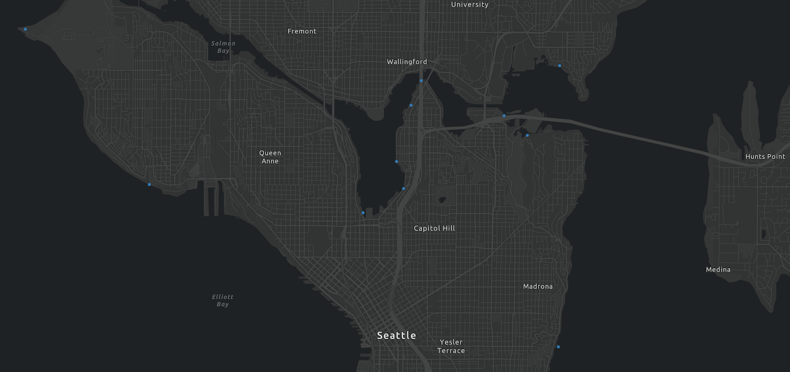

I introduced the [Koop PostGIS provider](https://github.com/doneill/koop-provider-pg) from a developer perspective in a previous [post](https://gh.jdoneill.com/2020/10/04/pgkoop/) where the output is GeoServices.  This post will guide us through installing a Koop service with support for PostGIS input and Vector Tiles as an output format.

## Install
Koop providers require you to first install [Koop](https://koopjs.github.io/).  You can add `koop-provider-pg` to your Koop server dependencies by installing it with npm:

```bash
# install koop cli using npm
$ npm install -g @koopjs/cli

# create a new koop app
$ koop new app pg-koop

# cd into the pg-koop app
$ cd pg-koop

# install provider
$ koop add provider koop-provider-pg

```

This will allow you to serve your PostGIS data as GeoServices.  You can add `@koopjs/output-vector-tiles` to generate `pbf` vector tiles as output:

```bash
$ koop add output @koopjs/output-vector-tiles
```

## Start the Koop server

```bash
# start koop server
$ koop serve
```

## Vector Tiles
The server will now support both GeoServices and Vector Tiles as output formats to your PostGIS input data.  Below is a list of the output routes for vector tiles:

```bash
# :id = ${schema}.$(table)

"VectorTileServer" output routes for the "pg" provider                       Methods
---------------------------------------------------------------------------  ---------
/pg/:id/VectorTileServer/:z([0-9]+)/:x([0-9]+)/:y([0-9]+).pbf                GET
/pg/:id/VectorTileServer/tiles.json                                          GET
/pg/rest/services/:id/VectorTileServer/:z([0-9]+)/:x([0-9]+)/:y([0-9]+).pbf  GET
/pg/rest/services/:id/VectorTileServer                                       GET, POST
/pg/rest/services/:id/VectorTileServer                                       GET, POST
/pg/rest/services/:id/VectorTileServer/resources/styles/root.json            GET
```

Your data can now be viewed in clients that support [Vector Tiles](https://github.com/koopjs/koop-output-vector-tiles).  Below is an example using [ArcGIS API for Javascript](https://developers.arcgis.com/javascript/latest/) and creating a [VectorTileLayer class](https://developers.arcgis.com/javascript/latest/api-reference/esri-layers-VectorTileLayer.html) with either the service URL or style URL to display the data:

```javascript
 require(["esri/Map", "esri/views/MapView", "esri/layers/VectorTileLayer"], function(
   Map,
   MapView,
   VectorTileLayer
 ) {
   // Create a Map
   const map = new Map({
     basemap: "oceans"
   });
   // Make map view and bind it to the map
   var view = new MapView({
     container: "viewDiv",
     map: map,
     center: [-122.31082,47.60606],
     zoom: 12
   });
  // add vector tile layer from pg-koop
   var tileLayer = new VectorTileLayer({
      url:
    "http://localhost:8080/pg/rest/services/${schema}.${table}/VectorTileServer"
   });
    map.add(tileLayer);
 });
```
Generating the following ouput of PostGIS point data over the [Ocean Basemap](https://www.arcgis.com/home/item.html?id=5ae9e138a17842688b0b79283a4353f6)


