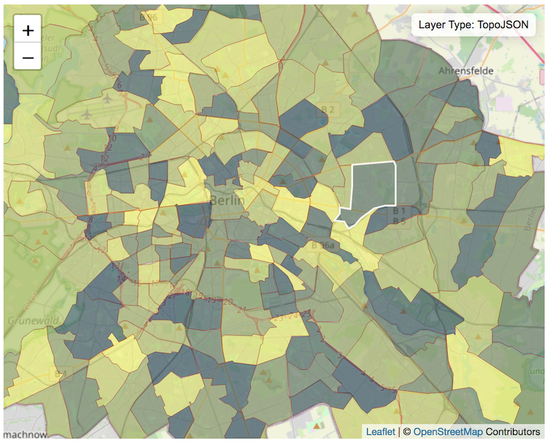

The [Sublime Text 3](https://www.sublimetext.com/) Map Preview Plugin is now available in the [package control repository](https://packagecontrol.io/packages/MapPreview)! Preview map layer files in your web browser powered by [LeafletJS](https://leafletjs.com/).  Currently features limited support for [GeoJSON](https://geojson.org/) and [TopoJSON](https://github.com/topojson/topojson/wiki) map file formats.

## Installation
Install MapPreview via [Package Control](https://packagecontrol.io/packages/MapPreview)

- Open Package Control: **Preferences > Package Control**
- Select **Package Control: Install Package**
- Type **MapPreview** into the search box and select the package to install it.

## Preview Map in Browser
With an open valid GeoJSON or TopoJSON file in Sublime Text 3:

- Right click and select **Map Preview > Preview in Browser**
- Select **Map Preview: Preview in Browser** from the command palette.

## Contribute
The plugin is open sourced on [GitHub](https://github.com/doneill/MapPreview) and open to any contributions.
