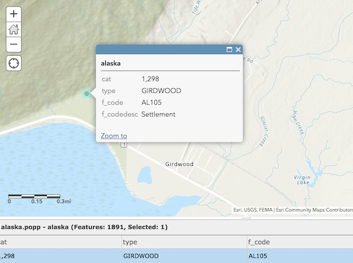
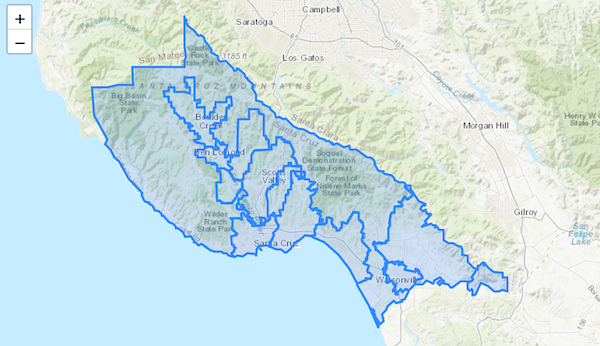
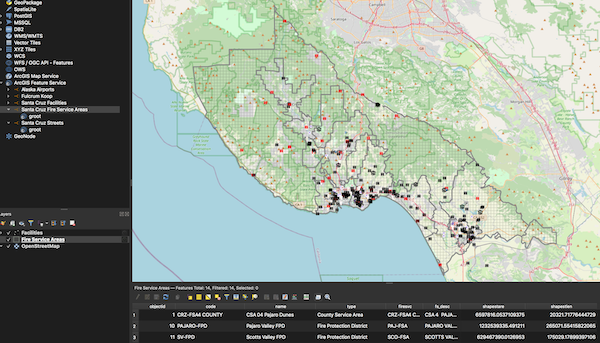

[Koop](https://koopjs.github.io) uses providers to transform data from one spatial format to another by converting the input data to GeoJSON and using output plugins to transform to various outputs, one officially supported output is [GeoServices](https://geoservices.github.io/).  The [koop provider pg](https://github.com/doneill/koop-provider-pg) uses PostGIS Spatial data as the input data to be transformed allowing ArcGIS clients access to the data.


## Database configuration
To get started using the **pg** provider and work with your PostGIS data in ArcGIS clients you need clone the [repo](https://github.com/doneill/koop-provider-pg) and setup your database connection.

- Open the **config/default.json** file and set the connection parameters as follows:

```json
{
  "db": {
    "host": "host",
    "port": 5432,
    "database": "dbname",
    "user": "user",
    "password": "password"
  }
}
```

The provider will now use this connection to query the data.

## Start the server
Once we have a database connection configured we can run the server to generate output routes to the connection PostGIS data provided by the **pg** provider. Koop provides a wrapper around an Express.js server to listen to incoming requests.  From the root of the repo project we can install the required npm modules and start the server with the following:

```bash
# install modules
=> npm start
# start the server
=> npm start
```

## Service endpoint format
The Koop service endpoint format is as follows: `{koop-server-instance}/{provider-framework}/{output-type}`.  For the **pg** provider those are defined by the following:

- koop server instance: http://localhost:8080
- provider fragment: /pg/rest/services/`${schema}.${table}`
- output fragment: FeatureServer/0

Where you provide the `${schema}.${table}` of the data you want to work with.

## Generate GeoJSON
Koop providers responsibilities include formatting requrests to the data source, in this case PostGIS, and convert the data to GeoJSON.  PostGIS can return the geometry as a GeoJSON feature object using [ST_AsGeoJSON](https://postgis.net/docs/ST_AsGeoJSON.html).  To build a feature collection the **pg** provider uses the following query:

```sql
SELECT jsonb_build_object(
    'type',     'FeatureCollection',
    'features', jsonb_agg(features.feature)
) FROM (
  SELECT jsonb_build_object(
    'type',       'Feature',
    'id',         gid,
    'geometry',   ST_AsGeoJSON(ST_Transform(geom,4326))::jsonb,
    'properties', to_jsonb(inputs) - 'gid' - 'geom'
  ) AS feature
  FROM (SELECT * FROM $[table:raw]) inputs) features;
```

The `$[table:raw]` is provided by the **pg** provider fragment

## Working with the data
Now that we have defined the url schema, we can start working with the data in various GeoService clients.

### ArcGIS Online WebMap
An easy way to confirm the data is working is by opening it up in a webmap provided by ArcGIS Online.  You can use the `url` parameter to get access to the feature service and visualize it in a browser.

`https://www.arcgis.com/home/webmap/viewer.html?url=http://localhost:8080/pg/${schema}.${table}/FeatureServer/`



### Esri Leaflet
There is an example web application provided in the repo in the **src/view/** folder where you can replace the `${schema}.${table}` in *map.js* to see the layer rendered in an Esri Leaflet app.

```javascript
// esri leaflet feature layer
L.esri.featureLayer({
    url: 'http://localhost:8080/pg/${schema}.${table}/FeatureServer/layers'
  }).addTo(map);
```



### QGIS
You can add ArcGIS Feature Services in QGIS using the **Data Source Manager > ArcGIS Feature Service > New Connection**.  Name the layer appropriately and paste your Koop pg url with the following format:

`http://localhost:8080/pg/rest/services/${schema}.${table}/FeatureServer`

After saving the connection by pressing **Ok** you should see the feature layer listed once connected to the service.   You can then add the layer to your map.



### Query
The query operation is supported on Koop services and you can use the result in any of the clients listed above.  Below is an example query where you can define the **outFields** with comma separated `${fields-2-return}`:

`http://localhost:8080/pg/rest/services/${schema}.${table}/FeatureServer/0/query?where=1=1&outFields=${fields-2-return}&returnGeometry=true&f=json`

## Moving forward
Dive deeper into the source in the [koop provider pg repo](https://github.com/doneill/koop-provider-pg) and read more about koop providers [here](https://koopjs.github.io/docs/usage/provider).  Future considerations to combine this provider with a web application to display a catalog of feature services provided by the PostGIS database connection.
